# Hebergement d'un site par dossier et par nom sous Apache2

Fait par Exode NGAMENEDE le 13/09/2024


# Introduction

Apache est un logiciel de serveur web gratuit et open-source qui alimente environ 46% des sites web àtravers le monde. Le nom officiel est Serveur Apache HTTP et il est maintenu et développé par Apache Software Foundation.

Il permet aux propriétaires de sites web de servir du contenu sur le web – d’où le nom « serveur web » -. C’est l’un des serveurs web les plus anciens et les plus fiables avec une première version sortie il y a plus de 20 ans, en 1995.


# Installation d'Apache2 sous Ubuntu 20.04
Le serveur Apache2 est un serveur open-source et installable sous les systemes d'exploitation Windows  et Linux. 
Pour installer Apache2 sous Ubuntu il faut suivre les etapes suivantes: 

**Etape 1:**  Mettre a jour les paquets du systeme 

	Apres avoir executer la commande **sudo -s** pour se connecter en tantque Root superutilisateur,avant toute autre  operation on doit mettre  a jour les paquets pour une bonne marche.

	```

	apt update
	```
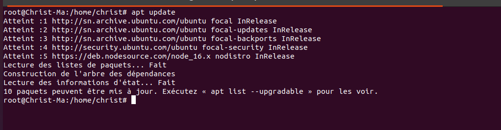
Figure: Mise a jour des paquets du systeme
	


**Etape 2:** Installation du serveur Apache2

Apres la mise a jour des paquets on peut maintenant installer le serveur Apache2 par la commande suivante:

	```
	apt install apache2
	```

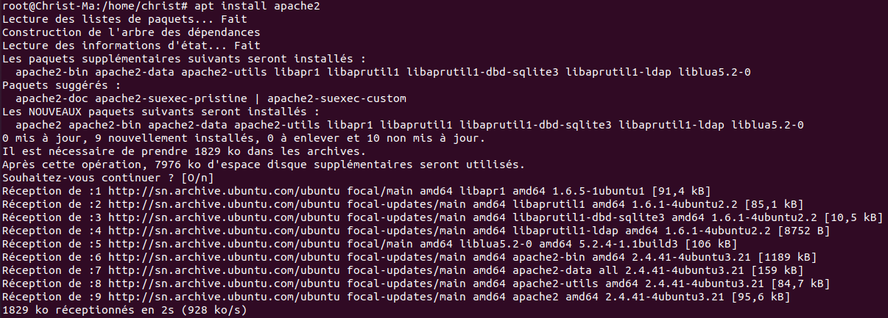
Figure: Installation du serveur Apache2

**Etape 3:** Verification d'installation du serveur Apache2
   
   Apres l'installation du serveur on verifie le paquet par la commande suvante: 

	```
	apt policy apache2
	```

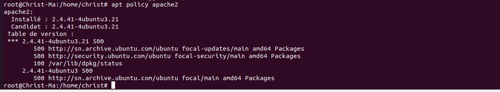
Figure: Verification du serveur Apache2


Le serveur Apache2 utilise le port 80,verifions si le port 80 est ouvert avec la commande suivante: 

	```
	netstat -anp |grep -w 80 
	```

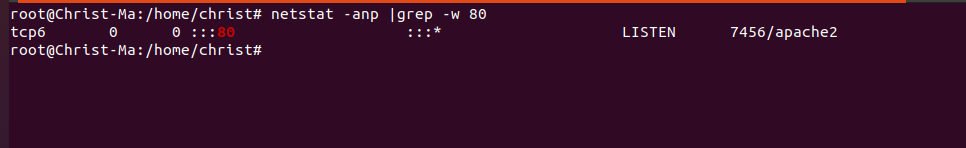
Figure: Verification du port Apache2

:::success
Quelques fichiers et repertoires importants  
:::


Une fois le serveur Apache2 installe,on doit connaitre ses  fichiers  importants: 

- Le fichier de configuration du serveur Apache  qui se trouve dans **/etc/apache2/apache2.conf**
- Le document root qui est le repertoire dans lequel tous fichiers d'Apache2 sont charges **/var/www/html**


# Hebergement d'un site web par dossier  sous Apache2

  L'hebergement d'un site par dossier  est tres important.Nous devons savoir qu'une fois le serveur en place il a son site par defaut dans le document root avec un fichier index.html qui se lance au demarrage.Ainsi quand on prend un naviateur par defaut Firefox sous Ubuntu on tape **localhost** directement la page suivant apparait.

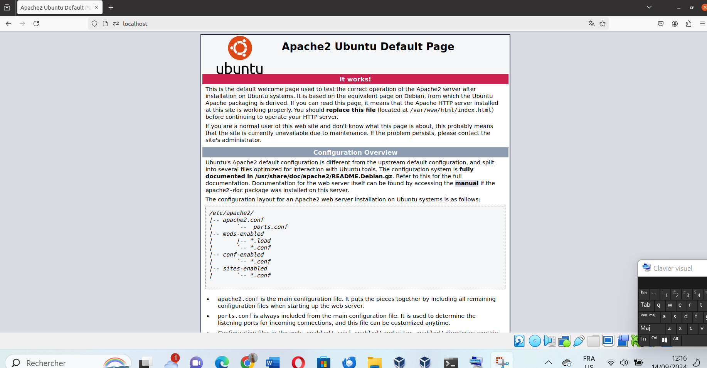
Figure: Site  d'Apache2 par defaut


**Pour la mise en place de notre site par dossier on doit suivre les etapes suivantes:**


**Etape 1:**  Se positionner dans le document root** 

Pour cela on doit se  deplacer dans le document root **/var/www/html**  
	```
	cd /var/wwww/html
	```


Figure: Document root d'Apache


**Etape 2:**  Creation de notre dossier **dossier_site1** 

On cree le dossier avec la commande suivante 

	```
	mkdir dossier_site1
	
	```


Figure: Creation du dossier


**Etape 3:** Deplacement dans le repertoire dossier_site1
On se  deplace dans le dossier dossier_site1


	```
	cd dossier_site1
	
	```

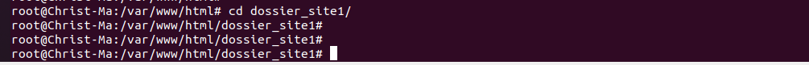
Figure: Deplacement dans le dossier


**Etape 3:** Creation et edition de notre fichier index.html 

On cree alors un fichier index.html  et on ajoute du contenu comme sur les figures suivantes:


	```
	touch index.html
	nano index.html
	```


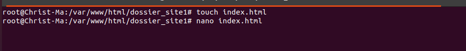
Figure: Creation du fichir index.html


	On ajoute le contenu suivant:

	```
	<!DOCTYPE html>
<html>
<head>
	<meta charset="utf-8">
	<meta name="viewport" content="width=device-width, initial-scale=1">
	<title>Hebergement par dossier</title>
</head>
<body>
<h2>Bonjour les amis,on a reussi notre hebergement par dossier sous Apache</h2>
</body>
</html>
	```


**Etape 4:** Test de bon fonctionnement 


Apres toutes ces configurations on peut maintenant tester notre site.Pour cela on prend on navigateur et on met (http://localhost/dossier_site1/) et on valide


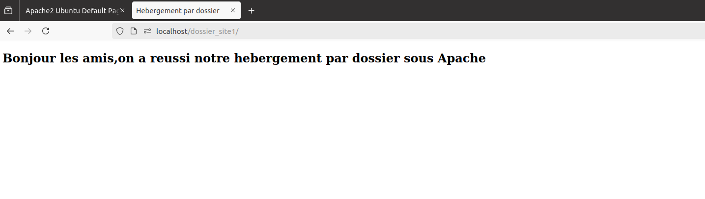
Figure: Test reussi 


# Hebergement d'un site web par nom  sous Apache2

Heberger un site par nom est le moyen le plus utilise car on aura juste a mettre le nom donne a notre site et on parvient a acceder au site.Pour la mise en pratique apres tout ce que nous avons fait jusqu'ici le travail devient facile.On suit seulement ces quelques etapes.

**Etape 1:**  Creation d'un site virtuel 

:::warning
On doit savoir que toutes les etapes precedentes sont faites

- Installation du serveur
- Creation du dossier du site dans le document root
- Creation du fichier index.html
:::


Pour creer le site virtuel on se deplace dans /etp/apache2/sites-available et on cree un fichier avec extension .conf 


	```
	cd /etc/apache2/sites-available
	touch site1.conf
	```


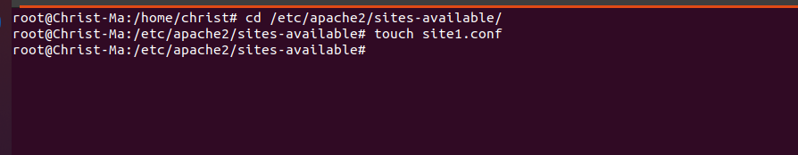
Figure: Creation du fichier de configuration de notre site virtuel


On edite le fichier site1.conf et on met les parametres essentiels pour notre site 
```
<VirtualHost *:80>
    ServerName site-docus.sn
    DocumentRoot /var/www/html/dossier_site1
    directoryIndex index.html

</VirtualHost>

```
Figure: Configuration de notre sitre par nom


**Explication du code**
- Les balises VirtualHost : 
	Ces balises montrent que nous voulons creer un site virtuel et 80 montre que le site tourne sur le port 80 qui est le port par defaut d'Apache

- ServerName :Ce parametre designe le nom de notre site par nom 
- DocumentRoot : C'est le repertoire ou se trouve nos fichiers du site
- DirectoryIndex : Il designe directement sur quel fichier le site va demarrer une fois le nom du site sur le navigateur

:::danger

 Respect de chaque caratere minuscule et majuscule,la notion de casse est tres importante 
:::


**Etape 2:**  Activation du site virtuel

Apres la configuration du site on l'active par la commande suivante: 

```
a2ensite site1.conf
```


Figure: Activation du site 


Apres l'activation du site on doit recharger le serveur Apache avec la commande suivante: 

```
systemctl restart apache2
```


Figure: rechargement du serveur Apache2


**Etape 3:** Resolution de nom 

On devrait avoir un serveur DNS pour faire la resolution du nom du site mais comme il n'y apas de serveur DNS il existe un fichier sous Ubuntu /etc/hosts qui nous permet de faire ca.Alors on edite ce fichier et on fait la resolution sur notre machine en local.
On edite le fichier


```
nano /etc/hosts
```

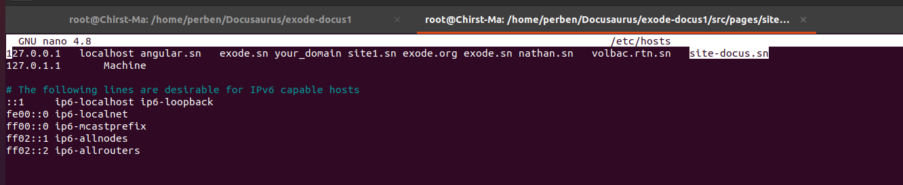
Figure: Resolution du nom 


**Etape 4:** Test de bon fonctionnement

Apres ces differentes configurations on modifie notre fichier index.html 

```
nano /var/www/html/dossier_site1/index.html
```

Et on met le contenu suivant:

```
<!DOCTYPE html>
<html>
<head>
<meta charset="utf-8">
<meta name="viewport" content="width=device-width, initial-scale=1">
<title>Hebergement par nom</title>
</head>
<body>
<h2>Bonjour les amis,on a reussi notre hebergement par nom sous Apache</h2>
</body>
</html>


```

et  maintenant on test le site en prenant un navigateur et on met 
(http://site-docus.sn) et on accede au site


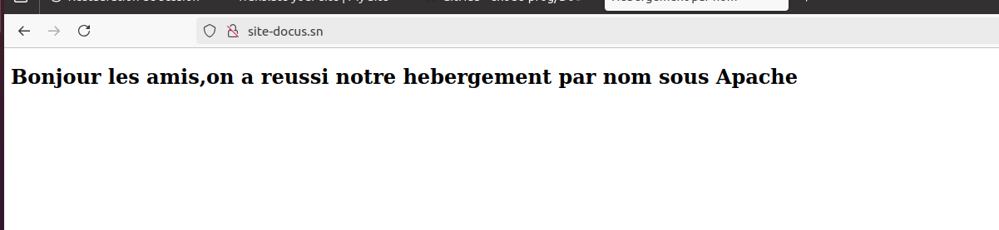
Figure:Acces au site par  nom 


`Pendant ce tutoriel nous avons appris les fondamentaux des hebergements sous Apache,des pratiques tres utiles sur le serveur Apache`

